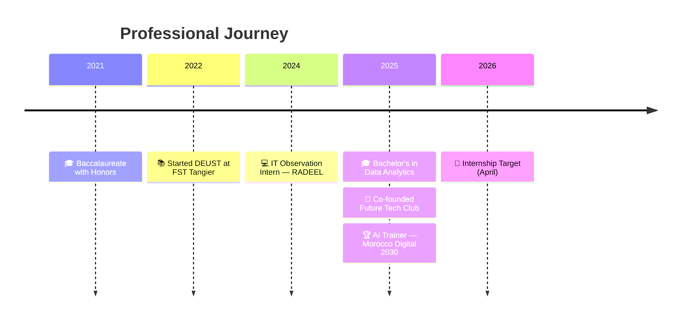

<!-- ╔══════════════════════════════════════════════════════════════╗ -->
<!-- ║                    SOUFIANE ZAARI                           ║ -->
<!-- ║              GitHub Profile README — v2.0                   ║ -->
<!-- ╚══════════════════════════════════════════════════════════════╝ -->

<!-- Header Banner -->
<div align="center">
  
</div>

<!-- Social Links -->
<div align="center">
  <a href="mailto:zari.soufiane@etu.uae.ac.ma">
    
  </a>
  <a href="https://linkedin.com/in/soufianezaari">
    
  </a>
  <a href="https://github.com/soufianezaari">
    
  </a>
  <a href="#">
    
  </a>
</div>

<br/>

<div align="center">
  
  &nbsp;
  
</div>

<br/>

<!-- Typing Animation -->
<div align="center">
  
</div>

<br/>

<!-- Divider -->


<br/>

##  &nbsp;About Me


```python
class SoufianeZaari:
    """Data Analyst & AI Trainer from Tangier, Morocco 🇲🇦"""

    def __init__(self):
        self.name       = "Soufiane ZAARI"
        self.role       = "Junior Data Analyst"
        self.education  = "BSc Data Analytics — FST Tangier"
        self.languages  = {
            "Arabic":  "Native 🇲🇦",
            "French":  "Fluent 🇫🇷",
            "English": "Professional 🇬🇧"
        }

    def current_focus(self):
        return [
            "📊 Designing dashboards with Power BI",
            "🤖 Building ML pipelines with Scikit-learn",
            "🧒 Training kids in AI & robotics",
            "🎯 Seeking internship — April 2026"
        ]

    def fun_fact(self):
        return "Co-founded a tech club & trained 60+ kids in AI! 🚀"
```

<br/>

- 🔭 &nbsp;Working on **Data Analytics & Machine Learning** projects
- 🌱 &nbsp;Deepening skills in **Power BI, Advanced SQL & Feature Engineering**
- 🏆 &nbsp;Selected as **AI Trainer** — Morocco Digital 2030 national program
- 👯 &nbsp;Open to collaborate on **Data Science & BI** open-source projects
- 📫 &nbsp;Reach me at **zari.soufiane@etu.uae.ac.ma**

<br clear="both"/>

<!-- Divider -->


<br/>

##  &nbsp;Tech Stack

<details>
<summary><b>📊 Data Analysis & Programming</b></summary>
<br/>
<p>
  
  
  
  
  
</p>

| Skill | Proficiency |
|-------|-------------|
| Python | `████████████████████░░` 90% |
| SQL | `█████████████████░░░░░` 85% |
| Pandas / NumPy | `████████████████████░░` 88% |
| PHP | `██████████████░░░░░░░░` 70% |

</details>

<details>
<summary><b>🤖 Machine Learning & Statistics</b></summary>
<br/>
<p>
  
  
  
  
</p>

**Techniques & Methods:**

<p>
  
  
  
  
  
  
  
  
</p>

| Skill | Proficiency |
|-------|-------------|
| Scikit-learn | `████████████████░░░░░░` 80% |
| Matplotlib / Seaborn | `█████████████████░░░░░` 85% |

</details>

<details>
<summary><b>📈 Business Intelligence & Visualization</b></summary>
<br/>
<p>
  
  
  
</p>

| Skill | Proficiency |
|-------|-------------|
| Power BI | `█████████████████░░░░░` 85% |
| Data Storytelling | `████████████████░░░░░░` 80% |

</details>

<details>
<summary><b>🗄️ Databases</b></summary>
<br/>
<p>
  
  
</p>

| Database | Proficiency |
|----------|-------------|
| MySQL | `█████████████████░░░░░` 85% |
| SQLite | `████████████████░░░░░░` 82% |

</details>

<details>
<summary><b>🔧 Tools & Frameworks</b></summary>
<br/>
<p>
  
  
  
  
  
  
</p>
</details>

<details open>
<summary><b>📊 Quick Overview</b></summary>
<br/>

```text
Programming    ███████████████████░░  Python, SQL, PHP
Data Analysis  ████████████████████░  Pandas, NumPy, EDA
Machine Learn  ████████████████░░░░░  Scikit-learn, Models
Visualization  █████████████████░░░░  Power BI, Matplotlib
Databases      █████████████████░░░░  MySQL, SQLite
Tools          ████████████████████░  Git, Jupyter, VS Code
```

</details>

<br/>

<!-- Divider -->


<br/>

##  &nbsp;Featured Projects

<div align="center">

<!-- Project 1: UniSchedule -->
<a href="https://github.com/you-bj/fstt-emploi-temps">
  
</a>
&nbsp;
<!-- Project 2: IMDb Prediction -->
<a href="https://github.com/SoufianeZaari/IMDb-Prediction-Project">
  
</a>

<br/><br/>

<!-- Project 3: Social Network -->
<a href="https://github.com/SoufianeZaari/Visualisation-des-relations-dans-un-mini-reseau-social">
  
</a>
&nbsp;
<!-- Project 4: Morocco vs Turkey -->
<a href="https://github.com/SoufianeZaari/Mar-vs-Turk">
  
</a>

</div>

<br/>

### 📋 Project Details

<table>
  <thead>
    <tr>
      <th width="5%">🔢</th>
      <th width="20%">Project</th>
      <th width="30%">Tech Stack</th>
      <th width="35%">Highlights</th>
      <th width="10%">Links</th>
    </tr>
  </thead>
  <tbody>
    <tr>
      <td align="center">01</td>
      <td><b>🗓️ UniSchedule</b><br/><sub>Timetable Manager</sub></td>
      <td>
        
        
        
      </td>
      <td>
        • MVC + Facade design patterns<br/>
        • Real-time <b>conflict detection</b> engine<br/>
        • Bulk CSV import & automated <b>PDF generation</b><br/>
        • <b>500+</b> academic sessions managed
      </td>
      <td align="center">
        <a href="https://github.com/you-bj/fstt-emploi-temps"></a>
      </td>
    </tr>
    <tr>
      <td align="center">02</td>
      <td><b>🏢 Data Center Mgmt</b><br/><sub>IT Resource Platform</sub></td>
      <td>
        
        
        
      </td>
      <td>
        • <b>15+ normalized tables</b> with RBAC<br/>
        • Statistical dashboards for utilization rates<br/>
        • Reservation conflict validation logic
      </td>
      <td align="center">
        <a href="https://github.com/khalid058r/php_projet"></a>
      </td>
    </tr>
    <tr>
      <td align="center">03</td>
      <td><b>🎬 IMDb Prediction</b><br/><sub>ML Rating Predictor</sub></td>
      <td>
        
        
        
      </td>
      <td>
        • Processed <b>50,000+ movie records</b><br/>
        • Feature engineering & advanced EDA<br/>
        • Regression & <b>Gradient Boosting</b> models<br/>
        • Cross-validation & hyperparameter tuning
      </td>
      <td align="center">
        <a href="https://github.com/SoufianeZaari/IMDb-Prediction-Project"></a>
      </td>
    </tr>
    <tr>
      <td align="center">04</td>
      <td><b>🌐 Social Network</b><br/><sub>Graph Analysis</sub></td>
      <td>
        
        
        
      </td>
      <td>
        • Centrality metrics (degree, betweenness)<br/>
        • <b>PCA & t-SNE</b> dimensionality reduction<br/>
        • Community detection & visualization
      </td>
      <td align="center">
        <a href="https://github.com/SoufianeZaari/Visualisation-des-relations-dans-un-mini-reseau-social"></a>
      </td>
    </tr>
    <tr>
      <td align="center">05</td>
      <td><b>📊 Morocco vs Turkey</b><br/><sub>Socio-Economic Study</sub></td>
      <td>
        
        
        
      </td>
      <td>
        • Comparative socio-economic indicators<br/>
        • Data cleaning & transformation<br/>
        • Statistical visualizations & trend analysis
      </td>
      <td align="center">
        <a href="https://github.com/SoufianeZaari/Mar-vs-Turk"></a>
      </td>
    </tr>
  </tbody>
</table>

<br/>

<!-- Divider -->


<br/>

##  &nbsp;GitHub Analytics

<div align="center">
  
  
</div>

<br/>

<div align="center">
  
</div>

<br/>

<div align="center">
  
</div>

<br/>

<!-- Divider -->


<br/>

## 🎓 Education & Certifications

<table>
  <tr>
    <th colspan="2">🎓 Academic Background</th>
  </tr>
  <tr>
    <td width="25%"><b>2025 – Present</b></td>
    <td>
      <b>Bachelor's in Data Analytics</b><br/>
      <sub>📍 Faculty of Sciences & Technology (FST) — Tangier</sub>
    </td>
  </tr>
  <tr>
    <td><b>2022 – 2025</b></td>
    <td>
      <b>DEUST in Mathematics, Computer Science & Physics</b><br/>
      <sub>📍 Faculty of Sciences & Technology (FST) — Tangier</sub>
    </td>
  </tr>
  <tr>
    <td><b>June 2021</b></td>
    <td>
      <b>Baccalaureate — Physical Sciences</b> &nbsp;🏅 <i>With Honors</i>
    </td>
  </tr>
</table>

<br/>

<table>
  <tr>
    <th colspan="3">📜 Certifications</th>
  </tr>
  <tr>
    <td width="5%" align="center">📊</td>
    <td><b>Data Analytics Program</b> (6 months)</td>
    <td width="30%">
      <sub><b>ALX</b> — Python, SQL, Power BI, EDA</sub>
    </td>
  </tr>
  <tr>
    <td align="center">🤖</td>
    <td><b>AI Career Essentials</b></td>
    <td>
      <sub><b>ALX</b> — AI Fundamentals, Data-Driven Decisions</sub>
    </td>
  </tr>
  <tr>
    <td align="center">📈</td>
    <td><b>Introduction to Data Science</b></td>
    <td>
      <sub><b>Cisco Networking Academy</b> — Foundations</sub>
    </td>
  </tr>
</table>

<br/>

<!-- Divider -->


<br/>

## 💼 Experience & Leadership



<br/>

<details>
<summary><b>🚀 President & Co-founder — Future Tech Club</b> &nbsp;|&nbsp; <i>Feb 2025 – Present</i></summary>
<br/>

- 🏆 Selected as **AI Trainer** in the Morocco Digital 2030 national initiative
- 👧🧒 Trained **60+ children** (ages 8–15) in Scratch, mBot2 robotics, NLP & Computer Vision
- 📢 Organized tech awareness events reaching **200+ students** at FST Tangier
- 🤝 Managed cross-functional teams for workshop planning and execution
- 📋 Developed structured curricula for progressive learning paths

</details>

<details>
<summary><b>💻 IT Observation Intern — RADEEL</b> &nbsp;|&nbsp; <i>August 2024</i></summary>
<br/>

- 📋 Documented IT workflows & processed **200+ internal service requests**
- 🔍 Observed database systems and administrative IT procedures
- 📊 Gained exposure to customer data management systems

</details>

<br/>

<!-- Divider -->


<br/>

## 🎯 Roadmap 2025–2026

<div align="center">

| Status | Goal | Target |
|--------|------|--------|
| ✅ | Co-found a tech club | Done |
| ✅ | Complete ALX Data Analytics Program | Done |
| ✅ | Train children in AI — Morocco Digital 2030 | Done |
| 🔄 | Build 3+ end-to-end Power BI dashboards | In Progress |
| 🔄 | Master Advanced SQL & Statistical Modeling | In Progress |
| 🎯 | Secure a 2-month Data Analyst internship (April 2026) | Planned |
| 🎯 | Contribute to open-source data projects | Planned |
| 🎯 | Learn Apache Spark for big data processing | Planned |

</div>

<br/>

<!-- Divider -->


<br/>

## 🌐 Languages

<div align="center">

```text
Arabic   ████████████████████  Native       🇲🇦
French   ██████████████████░░  Fluent       🇫🇷
English  ████████████████░░░░  Professional 🇬🇧
```

</div>

<br/>

<!-- Divider -->


<br/>

## 🤝 Let's Connect

<div align="center">
  <a href="mailto:zari.soufiane@etu.uae.ac.ma">
    
  </a>
  &nbsp;
  <a href="https://linkedin.com/in/soufianezaari">
    
  </a>
  &nbsp;
  <a href="https://github.com/soufianezaari">
    
  </a>
</div>

<br/>

<div align="center">
  
</div>

<br/>

<div align="center">
  <picture>
    <source media="(prefers-color-scheme: dark)" srcset="https://raw.githubusercontent.com/platane/snk/output/github-contribution-grid-snake-dark.svg" />
    <source media="(prefers-color-scheme: light)" srcset="https://raw.githubusercontent.com/platane/snk/output/github-contribution-grid-snake.svg" />
    
  </picture>
</div>

<br/>

<!-- Footer -->
<div align="center">
  
</div>

<div align="center">
  <sub>⭐ Star my repos if you find them useful! • Built with ❤️ by Soufiane ZAARI</sub>
</div>
